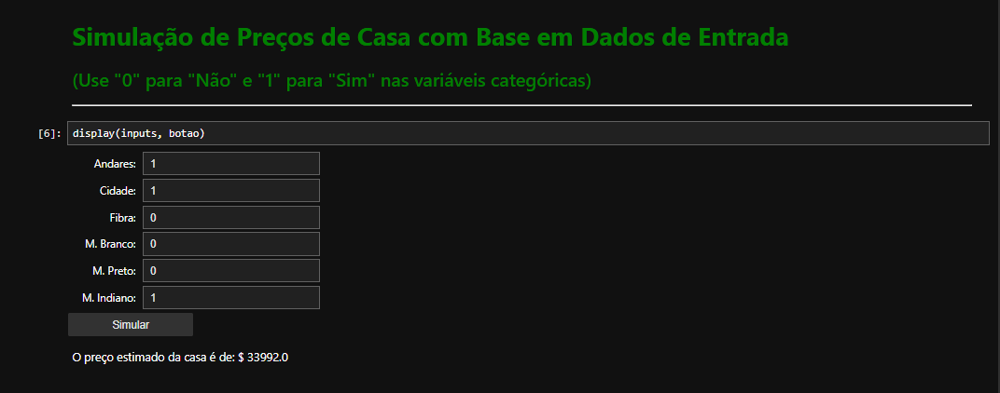

# Regressão Linear - HousePricing

## Neste projeto, criei um modelo de machine learning usando a técnica de Regressão Linear para fazer previsões sobre os preços de imóveis com base em um conjunto de características conhecidas dos imóveis. Inicialmente, coletei dados de um conjunto disponível no Kaggle e criei uma amostra representativa para facilitar o desenvolvimento do modelo.
## Tecnologias: Python, Pandas, Numpy, Seaborn, Matplotlib, Scipy, scikit-learn.

