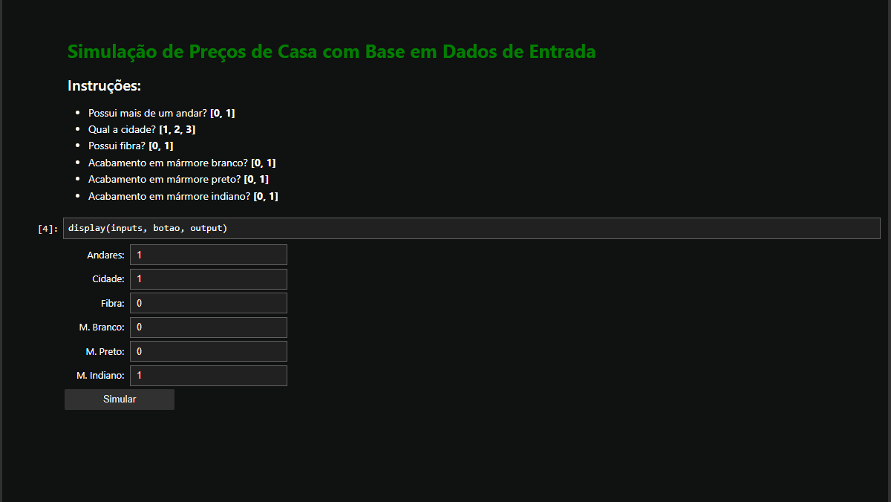

# Previsão de Preços de Casas com Regressão Linear

## Visão Geral
Este projeto utiliza a técnica de Regressão Linear para prever os preços de casas com base em diversas características. Além disso, um simulador interativo foi desenvolvido para permitir que os usuários insiram as características das casas e obtenham previsões de preços.

## Dataset
### Fonte
- [Kaggle: HousePricing](https://www.kaggle.com/greenwing1985/housepricing)

### Descrição dos Dados
O dataset contém as seguintes características:
- `Area` - Área do imóvel em metros quadrados
- `Garage` - Quantidade de vagas de garagem
- `FirePlace` - Quantidade de lareiras
- `Baths` - Quantidade de banheiros
- `White Marble` - Acabamento em mármore branco? (1: Sim, 0: Não)
- `Black Marble` - Acabamento em mármore preto? (1: Sim, 0: Não)
- `Indian Marble` - Acabamento em mármore indiano? (1: Sim, 0: Não)
- `Floors` - Possui mais de um andar? (1: Sim, 0: Não)
- `City` - Cidade
- `Solar` - Aquecimento solar? (1: Sim, 0: Não)
- `Electric` - Rede Elétrica? (1: Sim, 0: Não)
- `Fiber` - Fibra óptica? (1: Sim, 0: Não)
- `Glass Doors` - Portas de vidro? (1: Sim, 0: Não)
- `Swimming Pool` - Piscina? (1: Sim, 0: Não)
- `Garden` - Jardim? (1: Sim, 0: Não)
- `Prices` - Preços dos imóveis

## Estrutura do Projeto
1. **Importação de Bibliotecas**: Importação das bibliotecas necessárias para o projeto.
2. **Carregamento e Visualização dos Dados**: Leitura do dataset e visualização inicial dos dados.
3. **Pré-processamento dos Dados**: Limpeza e preparação dos dados para análise.
4. **Análise Exploratória dos Dados (EDA)**: Análise gráfica e estatística das características dos dados.
5. **Criação do Modelo de Regressão Linear**: Construção e treinamento do modelo de regressão linear.
6. **Avaliação do Modelo**: Avaliação da performance do modelo utilizando métricas apropriadas.
7. **Criação do Simulador Interativo**: Utilização de widgets do `ipywidgets` para criar um formulário interativo que permite ao usuário inserir características de uma casa e obter uma previsão do preço.
8. **Teste do Simulador**: Teste do simulador com dados de entrada fictícios para garantir que o modelo está funcionando corretamente.

## Insights Importantes
Aqui estão alguns insights importantes obtidos a partir da análise exploratória dos dados:

1. **Andares**: Casas com mais de um andar tendem a ter preços significativamente mais altos.
2. **Cidade**: A localização (cidade) influencia fortemente o preço dos imóveis.
3. **Fibra Óptica**: A presença de fibra óptica está associada a um aumento nos preços das casas.
4. **Tipos de Mármore**: O acabamento com mármore (branco, preto ou indiano) também tem um impacto significativo no preço das casas.

### Distribuição dos Preços dos Imóveis

### Impacto de Possuir 2 ou Mais Andares no Preço

### Impacto da Cidade no Preço

## Como Utilizar
### Notebook de Regressão Linear
1. Abra o notebook "Regressao-Linear-HousePricing.ipynb".
2. Execute todas as células do notebook para treinar e avaliar o modelo de regressão linear.

### Simulador Interativo
1. Abra o notebook "Simulador-Interativo.ipynb".
2. Execute todas as células do notebook.
3. Utilize os widgets interativos para inserir as características da casa.
4. Clique no botão "Simular" para obter a previsão do preço da casa.

## Contribuições
Contribuições são bem-vindas! Se você encontrar algum problema ou tiver sugestões para melhorias, sinta-se à vontade para abrir uma issue ou enviar um pull request.
